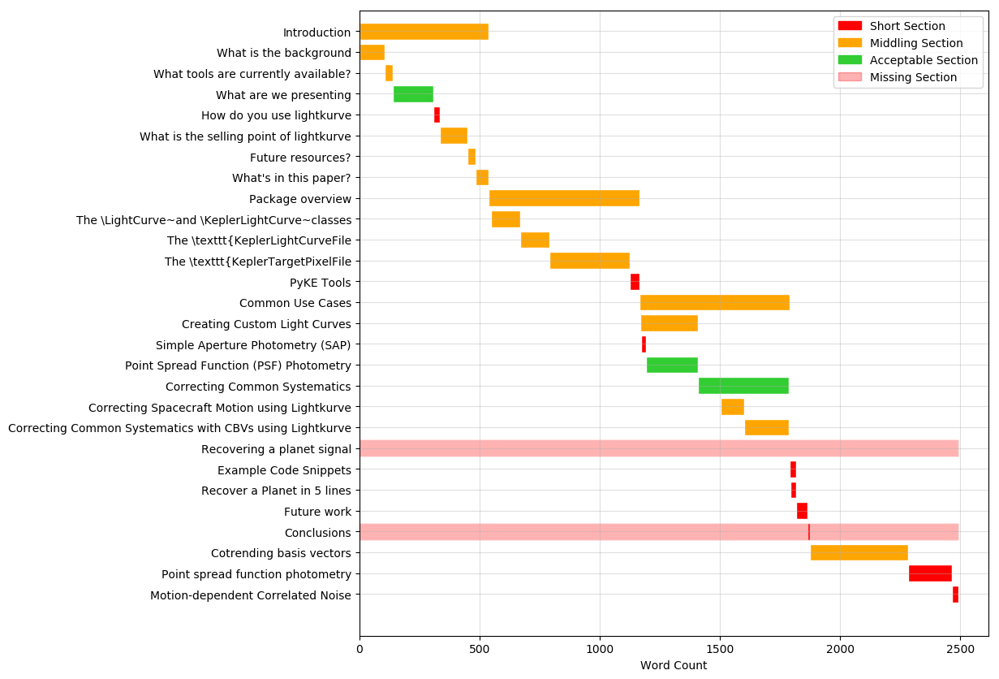

# pyke-paper
dump: wrote maskfile.txt

*Automagically building pdf with travis-ci using [dfm's guide](http://dfm.io/posts/travis-latex/).*

## Current tasks

* Christina: Generate plots with new code/new styles
* Christina: Recovering a planet section
* Gully: "What tools are currently available"
* Geert: Introduction/Background on Kepler
* AMC: PSF Photometry. (This section is currently maths and no motivation.)

## Diagnosis

